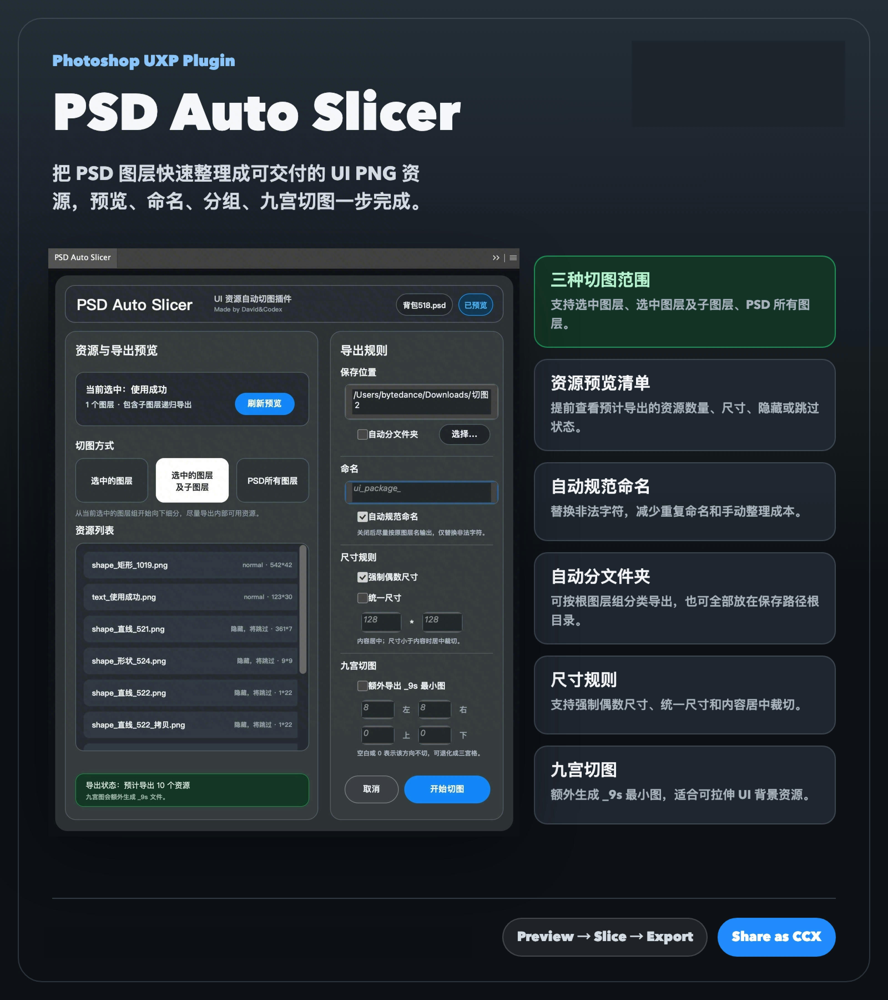

# PSD Auto Slicer

A Photoshop UXP panel plugin for automatically slicing and exporting UI assets from PSD files.



---

## Features / 功能

- **Three export modes** — export selected layers, selected layers with children, or all layers in the PSD
- **Auto naming** — adds type prefix (`shape_`, `image_`, `text_`), normalizes to lower snake_case
- **Even-size rule** — forces even pixel dimensions for engine compatibility
- **Uniform size** — pads or crops all exports to a fixed canvas size
- **Nine-slice export** — generates a compact `_9s` image alongside the original, ready for engine nine-slice scaling
- **Auto folder** — organizes exports into subfolders by root group name
- **Export manifest** — writes `export_manifest.json` with full metadata for each asset
- **Resizable panel** — docks into Photoshop sidebar, scales down while keeping the export button always visible

---

三种导出模式、自动命名、偶数尺寸、统一尺寸、九宫切图、自动分文件夹、导出清单，面板可缩放并始终显示切图按钮。

---

## Installation / 安装

### Double-click install (recommended) / 双击安装（推荐）

1. Download `PSD-Auto-Slicer-UXP-v0.2.30.ccx`
2. Double-click the file — Creative Cloud Desktop will install it automatically
3. Restart Photoshop
4. Open via **Plugins > PSD Auto Slicer**

> If Creative Cloud blocks the file, use the developer install method below.

---

1. 下载 `PSD-Auto-Slicer-UXP-v0.2.30.ccx`
2. 双击文件，Creative Cloud 桌面端会自动安装
3. 重启 Photoshop
4. 从 **Plugins > PSD Auto Slicer** 打开面板

> 如果 Creative Cloud 拦截安装，请使用下方开发者模式安装。

---

### Developer install / 开发者模式安装

1. Install [Adobe UXP Developer Tool](https://developer.adobe.com/photoshop/uxp/devtool/)
2. Click **Add Plugin...** and select `manifest.json` from the extracted plugin folder
3. Click **Load**, then open the panel in Photoshop

---

## How to Use / 使用方法

### PSD convention / PSD 规范（推荐）

Place exportable assets inside a top-level group named `EXPORT`:

```
EXPORT/
  Btn Start Normal
  Btn Start Pressed
  Icon Coin
  Panel Bg
```

You can also mark any layer anywhere with `@export` or `[export]` in the name, and skip layers with `@ignore` or `[ignore]`.

---

将可导出资源放在名为 `EXPORT` 的顶层图层组内，或在图层名中加 `@export` / `[export]` 标记，加 `@ignore` / `[ignore]` 跳过。

---

### Export steps / 导出步骤

1. Open your PSD in Photoshop
2. Open the **PSD Auto Slicer** panel
3. Click **刷新预览** to scan layers
4. Set the output folder, prefix, and rules in the right panel
5. Choose an export mode:
   - **选中的图层** — each selected layer/group as one PNG
   - **选中的图层及子图层** — recursively export fine-grained layers inside selection
   - **PSD 所有图层** — export all layers in the entire PSD
6. Click **开始切图**

---

1. 在 Photoshop 中打开 PSD
2. 打开 **PSD Auto Slicer** 面板
3. 点击 **刷新预览** 扫描图层
4. 在右侧面板设置输出路径、前缀和规则
5. 选择切图方式
6. 点击 **开始切图**

---

## Export Rules / 导出规则

### Naming / 命名

Auto-rename is on by default. It adds a type prefix and normalizes to `lower_snake_case`. Turn it off to keep original layer names (only illegal characters are replaced).

自动命名默认开启，添加类型前缀并转为小写下划线格式。关闭后尽量保留原图层名，仅替换非法字符。

### Even Size / 偶数尺寸

Forces width and height to be even numbers by adding 1 transparent pixel if needed. Useful for most game engines.

强制宽高为偶数，必要时补 1px 透明像素，适配大多数游戏引擎。

### Uniform Size / 统一尺寸

Pads all exports to a fixed `W × H` canvas, content centered. If content is larger than the target size, it is cropped from center.

将所有导出资源统一到指定尺寸画布，内容居中；内容超出时从中心裁切。

### Nine-Slice / 九宫切图

Enable in the UI or add `@9s` / `@9s(left,top,right,bottom)` to a layer name. Exports two files:

- `shape_panel_bg.png` — original trimmed image
- `shape_panel_bg_9s.png` — compact nine-slice source (corners + minimal center strip)

Border fields: **Left / Right** = pixels from each horizontal edge to the slice guide. **Top / Bottom** = pixels from each vertical edge. Leave a field empty or `0` to skip that axis (degrades to 3-slice).

---

在 UI 勾选或在图层名加 `@9s` / `@9s(左,上,右,下)` 触发。同时导出原图和 `_9s` 最小九宫图（保留四角和边条，中间压缩为最小拉伸区）。

边距字段：**左/右** 为从左右边缘到切割线的像素数，**上/下** 同理。留空或填 `0` 表示该方向不切，可退化为三宫格。

---

## Output / 输出文件

```
output_folder/
  GroupName/
    shape_panel_bg.png
    shape_panel_bg_9s.png
    image_icon_coin.png
    text_label_title.png
  export_manifest.json
```

`export_manifest.json` records name, size, type, nine-slice info, and source layer path for every exported asset.

`export_manifest.json` 记录每个资源的名称、尺寸、类型、九宫信息和来源图层路径。

---

## Requirements / 环境要求

- Adobe Photoshop 24.0 or later
- Creative Cloud Desktop (for CCX install)

---

## License

MIT
